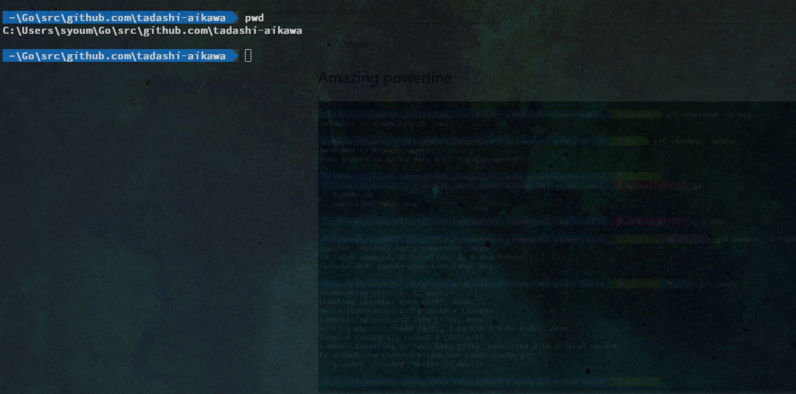
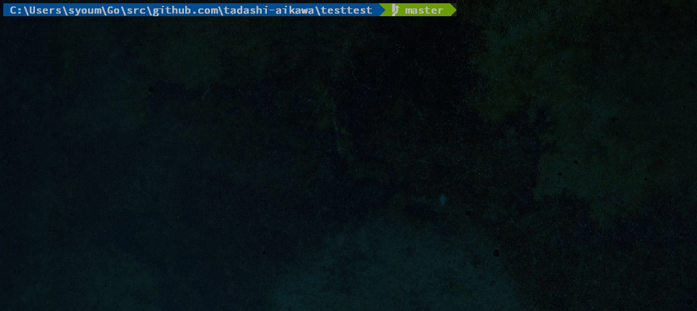

Owl Cmder Tools
===============

Support tools for cmder 🦉

Prerequirements
---------------

* [Cmder](http://cmder.net/)
* Use `cmd.exe` (Not bash!)

Amazing powerline
-----------------

### Prerequirements

* [AmrEldib/cmder-powerline-prompt](https://github.com/AmrEldib/cmder-powerline-prompt)

### Install

Copy `config/powerline_git.lua` to `%cmder_root%/config/`

Useful commands
---------------

### Prerequirements

* Add `bin` to your Path environment variable
* Install some tools

| Command | Required Tools |                Advanced settings                |
| ------- | -------------- | ----------------------------------------------- |
| cdg     | [fzf], [gowl]  |                                                 |
| cdr     | [fzf], [fd]    |                                                 |
| cdz     | [fzf]          | Copy `config/cdz.lua` to `%cmder_root%/config/` |
| gc      | [fzf]          |                                                 |
| gcr     | [fzf]          |                                                 |
| r       | [fzf]          |                                                 |
| vimd    | [fzf], [fd]    |                                                 |
| vimf    | [fzf], [fd]    |                                                 |

[fd]: https://github.com/sharkdp/fd
[fzf]: https://github.com/junegunn/fzf
[gowl]: https://github.com/tadashi-aikawa/gowl

### cdg

Move to git repositories with interactive fzf interface.

### cdr

Move to under the current directory with interactive fzf interface.

### cdz

Move to the directory visited recently with interactive fzf interface. 

### gc

Checkout local branch with interactive fzf interface. (git)

### gcr

Checkout remote branch with interactive fzf interface. (git)

### r

Search history with interactive fzf interface.

### vimd

Open a directory under the current ones by vim with interactive fzf interface.

### vimf

Open files under the current directory by vim with interactive fzf interface.
